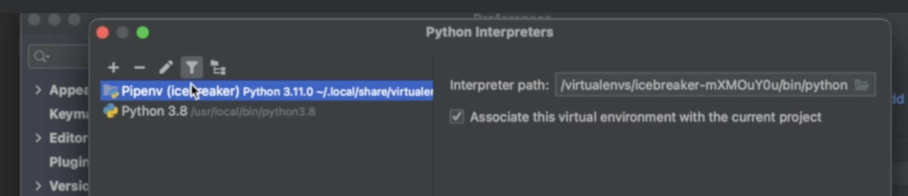
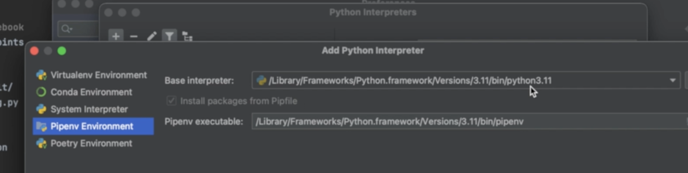
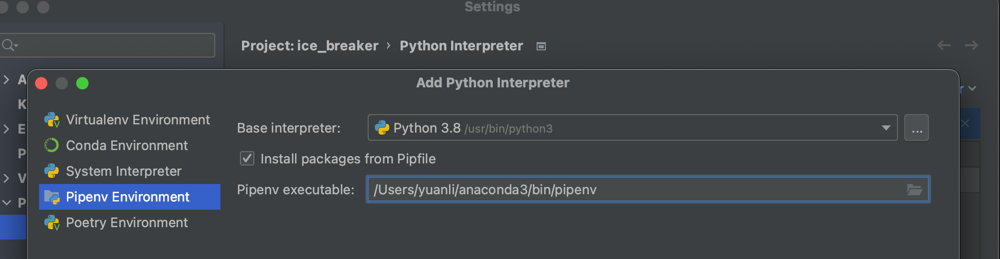
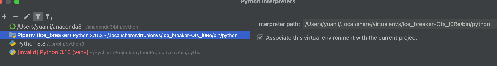
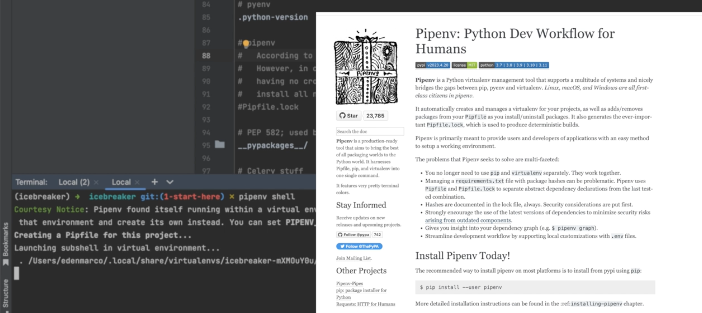
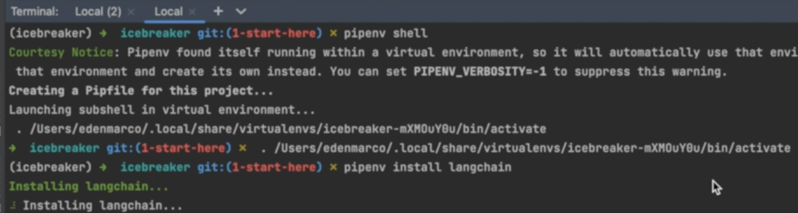

## Resource Links

- [Develop LLM powered applications with LangChain - Udemy Course](https://www.udemy.com/course/langchain/?couponCode=ST15MT31224)
- [Git repo - ice_breaker](https://github.com/emarco177/ice_breaker)
- [Discord discussion](https://discord.com/invite/DcxSsbaav7)
  - <https://discord.com/channels/1099224935320256545/1115310131505278977>
- [Langchain Python Documentation](https://python.langchain.com/docs/get_started/introduction)

## 课程笔记

### 5 Pycharm setup

- [Pipenv Crash Course - Youtube](https://www.youtube.com/watch?v=6Qmnh5C4Pmo&t=1s)
  - [Pipenv官方文档](https://pipenv.pypa.io/en/latest/)
  - [Python—pipenv精心整理教程](https://juejin.cn/post/6844904202737713160)
    - 安装pipenv `sudo pip install pipenv`注：无法用pip管理的包，pipenv同样无法使用。pipenv依赖：psutil, virtualenv-clone, pew, certifi, urllib3, chardet, requests, mccabe, pyflakes, pycodestyle, flake8等第三方模块。
    - `pipenv shell`  生成`Pipfile`文件
    - `pipenv install langchain` 即可生成`Pipfile.lock`文件

课程设置：

我的设置，添加interpreter:
Pipenv Executable: `/Users/yuanli/anaconda3/bin/pipenv`

成功后： `/Users/yuanli/.local/share/virtualenvs/ice_breaker-Ofs_l0Re/bin/python`

